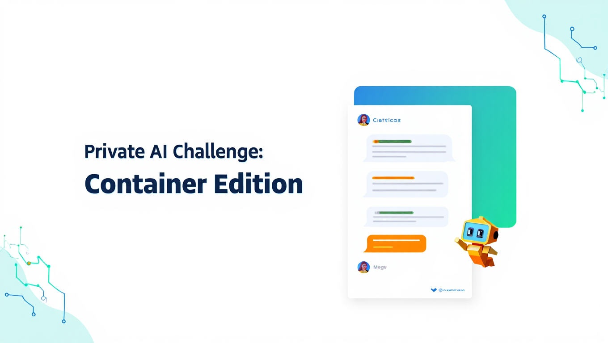

# Private AI Challenge - Containerized AI Deployment

<p align="center">
  
</p>

This project allows you to deploy your own private AI assistant with a locally running Large Language Model (LLM) and a ChatGPT-like web interface. It's a practical application of Docker containerization that gives you control over your AI 
interactions without relying on external cloud services.

## What You'll Deploy

1. **Ollama**: A lightweight, local LLM server that can run various open-source models
2. **Open WebUI**: A user-friendly web interface similar to ChatGPT that connects to your Ollama server

## System Requirements

- Docker and Docker Compose installed **OR** Podman and podman-compose installed
- At least 4GB of RAM (8GB+ recommended for larger models)
- At least 5GB of free disk space (more for larger models)
- Basic knowledge of terminal commands

## Container Engine Support

This project supports both Docker and Podman:

- **Docker**: The traditional container engine, widely used and well-documented
- **Podman**: A daemonless container engine that can run containers as a non-root user

The scripts will automatically detect which container engine is available on your system and use the appropriate commands.

## Automated Deployment (Recommended)

We've created a deployment script that automates the entire process. This is the easiest way to get started.

### Running the Deployment Script

```bash
# Make the script executable if needed
chmod +x deploy.sh

# Run the deployment script
./deploy.sh
```

The script will automatically detect whether you're using Docker or Podman and adjust its commands accordingly.

### What the Script Does

1. **Server Configuration**:
   - Detects and prompts for your server's IP address
   - Uses default ports: 11444 for Ollama and 8090 for Open WebUI

2. **Model Selection**:
   - Offers a selection of popular LLMs (Gemma, Llama 2, Mistral, etc.)
   - Allows you to specify a custom model from [Ollama's library](https://ollama.com/library)

3. **Deployment**:
   - Sets up Docker containers for both Ollama and Open WebUI
   - Downloads your selected AI model
   - Configures the connection between services
   - Verifies the deployment is working correctly

### Default Configuration

- **Ollama**: Runs on port 11444
- **Open WebUI**: Runs on port 8090
- **Default Model**: Gemma 2B (smallest and fastest option)

## Manual Installation

If you prefer to set up everything manually or want to understand the underlying components, follow these steps:

### 1. Installing Ollama

Ollama is the backend service that runs the AI models locally.

```bash
# Create a directory for Ollama
mkdir -p ollama
cd ollama

# Create the docker-compose.yml file
cat > docker-compose.yml << 'EOF'
services:
  ollama:
    container_name: ollama
    image: ollama/ollama:latest
    volumes:
      - ./ollama_data:/root/.ollama
    ports:
      - "11444:11434"
    restart: unless-stopped
EOF

# Start the Ollama server (use 'podman compose' or 'podman-compose' if using Podman)
docker compose up -d

# Verify Ollama is running
curl http://localhost:11444
# Should respond with: "Ollama is running!"
```

**Note for Podman users**: If you're using Podman, replace `docker compose` with either `podman compose` (for newer Podman versions) or `podman-compose` (if installed via pip).

**Port Configuration**: If port 11444 is already in use on your system, modify the port mapping in the docker-compose.yml file (e.g., change `"11444:11434"` to `"YOUR-CUSTOM-PORT:11434"`).

### 2. Downloading an AI Model

After Ollama is running, you need to download at least one AI model. Here we use Gemma 2B, which is relatively small and fast.

```bash
# For Docker:
# Download the Gemma 2B model
docker exec -it ollama ollama pull gemma:2b

# Verify the model was downloaded successfully
docker exec -it ollama ollama list

# For Podman:
# Download the Gemma 2B model
podman exec -it ollama ollama pull gemma:2b

# Verify the model was downloaded successfully
podman exec -it ollama ollama list
```

The model should appear in the list after downloading.

**Available Models**: You can replace `gemma:2b` with any model from [Ollama's model library](https://ollama.com/library). Larger models (7B+) provide better quality responses but require more system resources.

### 3. Installing Open WebUI

Open WebUI provides a user-friendly interface similar to ChatGPT for interacting with your local AI models.

```bash
# Create a directory for Open WebUI
mkdir -p open-webui
cd open-webui

# Create the docker-compose.yml file
cat > docker-compose.yml << 'EOF'
services:
  open-webui:
    container_name: open-webui
    image: ghcr.io/open-webui/open-webui:main
    restart: always
    volumes:
      - open-webui-data:/app/backend/data
    environment:
      - OLLAMA_BASE_URL=http://YOUR-SERVER-IP:11444
    ports:
      - "8090:8080"

volumes:
  open-webui-data:
    driver: local
EOF

# Replace YOUR-SERVER-IP with your actual server IP address
# For local testing, you can use 127.0.0.1
sed -i "s/YOUR-SERVER-IP/$(hostname -I | awk '{print $1}')/g" docker-compose.yml

# Start the Open WebUI server
# For Docker:
docker compose up -d
# For Podman:
# podman compose up -d  # or podman-compose up -d
```

**Note for Podman users**: The volume configuration works with both Docker and Podman, but Podman may store the volumes in a different location.

**Using the Web Interface**:

1. Open a web browser and navigate to `http://YOUR-SERVER-IP:8090`
2. Create a new account on the login page
3. After logging in, select the `gemma:2b` model from the dropdown at the top
4. Start chatting with your locally-hosted AI!

**Note**: Responses may be slower than cloud-based services like ChatGPT because the model is running on your local CPU rather than specialized hardware.

Congratulations! You have now deployed your own private "ChatGPT" like AI model and Web UI.

## Troubleshooting

### Port Conflicts

If you encounter port conflicts during deployment:

1. **For Ollama**: Edit `ollama/docker-compose.yml` and change the port mapping:
   ```yaml
   ports:
     - "ALTERNATIVE-PORT:11434"
   ```

2. **For Open WebUI**: Edit `open-webui/docker-compose.yml` and change the port mapping:
   ```yaml
   ports:
     - "ALTERNATIVE-PORT:8080"
   ```
   Also update the `OLLAMA_BASE_URL` environment variable to match your Ollama port:
   ```yaml
   environment:
     - OLLAMA_BASE_URL=http://YOUR-SERVER-IP:OLLAMA-PORT
   ```

3. **Check for existing containers**: Run `docker ps` to see which containers might be using the ports you need.

4. **Stop conflicting containers**: Use `docker stop CONTAINER_NAME` to stop any containers that are using the ports you need.

### Connection Issues

If Open WebUI cannot connect to Ollama:

1. **Check IP Address**: Ensure the `OLLAMA_BASE_URL` in the Open WebUI docker-compose.yml file has the correct IP address and port

2. **Network Issues**: If running on separate machines, ensure there are no firewall rules blocking the connection

3. **Verify Ollama**: Run `curl http://YOUR-SERVER-IP:11444` to confirm Ollama is responding

### Permission Issues

If you encounter permission errors when removing data directories:

1. The cleanup script will attempt to use `sudo` for directories with permission issues
2. You may need to manually remove some directories with: `sudo rm -rf ./ollama/ollama_data`

## Maintenance and Management

### Cleanup

To remove all containers and data, use the provided cleanup script:

```bash
chmod +x cleanup.sh  # Make executable if needed
./cleanup.sh
```

This script will:
- Stop and remove all containers for Ollama and Open WebUI
- Remove associated volumes and networks
- Attempt to delete local data directories

The script automatically detects whether you're using Docker or Podman and uses the appropriate commands.

### Adding More Models

To add additional AI models to your deployment:

```bash
# For Docker:
# List available models
docker exec -it ollama ollama list

# Pull a new model (example: llama2)
docker exec -it ollama ollama pull llama2

# For Podman:
# List available models
podman exec -it ollama ollama list

# Pull a new model (example: llama2)
podman exec -it ollama ollama pull llama2
```

After downloading, the new model will appear in the model selection dropdown in the Open WebUI interface.

## Advanced Configuration

### Custom Model Parameters

You can customize model parameters by creating a Modelfile. For example:

```bash
cat > custom.modelfile << 'EOF'
FROM gemma:2b
PARAMETER temperature 0.7
PARAMETER top_p 0.9
SYSTEM You are a helpful AI assistant that specializes in explaining technical concepts clearly.
EOF

# For Docker:
docker exec -it ollama ollama create custom-gemma -f custom.modelfile

# For Podman:
# podman exec -it ollama ollama create custom-gemma -f custom.modelfile
```

### Persistent Storage

Both Ollama and Open WebUI are configured to use Docker volumes for persistent storage. Your chat history, settings, and downloaded models will persist across container restarts.

---

## About Alphabravo

<p align="center">
  
</p>

**AlphaBravo** provides products, services, and training for Kubernetes, Cloud, and DevSecOps. We are a Rancher and SUSE partner.

Contact **AB** today to learn how we can help you.

* **Web:** https://alphabravo.io
* **Email:** info@alphabravo.io
* **Phone:** (202)420-9736